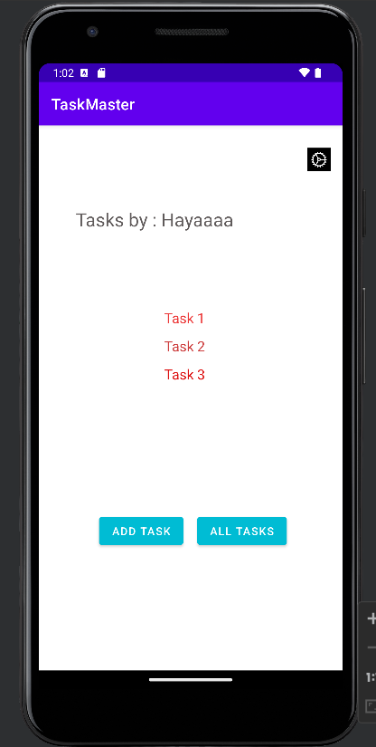
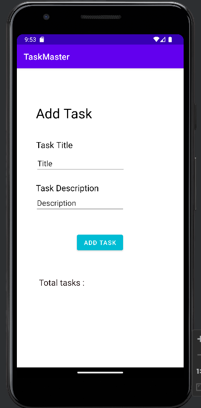
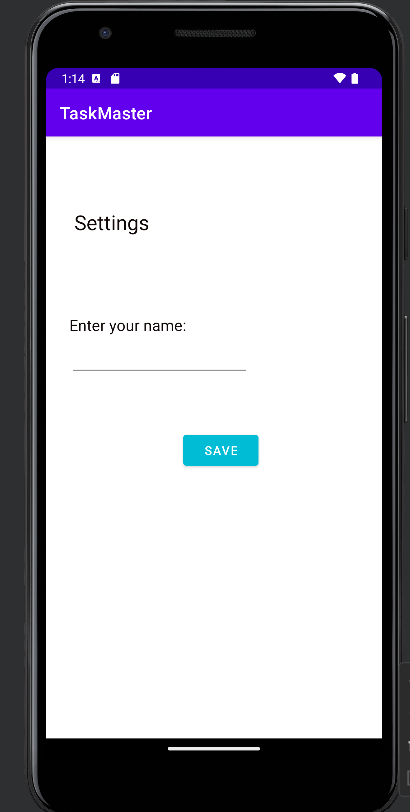
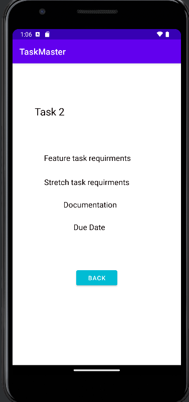

# taskmaster

## In Task Master you can:

 - navigate easily between pages
 - check all tasks you have
 - add new tasks to your list
 - by clicking on specific Task you'll be navigated to task chosen details page
 - by clicking on settings icon in home page you'll be navigated to settings page
 - you can change your username in Setting page and new username will be updated in your home page

## Screenshots:

### Home page

### Add Task page

### All Tasks page

### Settings page

### Task Details page

