 taskmaster

## In Task Master you can:

 - navigate easily between pages
 - check all tasks you have
 - add new tasks to your list
 - by clicking on specific Task you'll be navigated to task chosen details page
 - by clicking on settings icon in home page you'll be navigated to settings page
 - you can change your username in Setting page and new username will be updated in your home page
 - in home page can scroll up and down between list of tasks
 - You can re-check your task details requirements and state if complete,in progress.. etc by clicking on it
 - Whenever you add a task; your task title will be displayed on the home page and by clicking on it you can go to the details..

## Activities tested using Espresso Testing :

- AddTaskActivity
- SettingsActivity
- TaskDetailsActivity

## Tools used :

 - Android Studio
 - Cmd for Windows
 - AWS amplify
 - DynamoDB

### Lab 32, 8/11/2023 :

- Application's Database added to AWS
- Tasks Table Created on DynamoDB
- Tasks added by user are added to the table
- Tasks are viewed on the RecyclerView from DynamoDB

### Lab 33, 13/11/2023 :

- Teams Table Added to AWS
- Added Many to Many Relationship between tasks table and teams
- Teams are added, user cannot add Teams
- User can assign the task while adding it to specific team
- Tasks are filtered Based on the user team chosen in Settings.

### Lab 34, 15/11/2023 :

- Edit Task Activity added.
- User can update data about specific task.
- User can delete specific task.
- All changes are updated on DynamoDb.

### Lab 36, 20/11/2023 :

- User can sign up to taskmaster application using email,username and password.
- A verification code will be sent to user email to verify his email.
- Once his email is verified he can login using his email and password.
- Once the user log in he is navigated to the hom page where his nickname is displayed.
- User can logout and log in using another account, or signup using another email.

### Lab 37, 22/11/2023 :
- User can add an task image while adding the task from his own device
- If user chose the wrong image ; he can delete it while before saving and choosing another
- In case saved user saved the image, it will be uploaded as file in S3 in aws
- if no Image added no files will be uploaded on S3
- 
### Lab 38, 27/11/2023 :

- User can add title of the new task easily by sharing it from browser or any other app, Steps :
  
     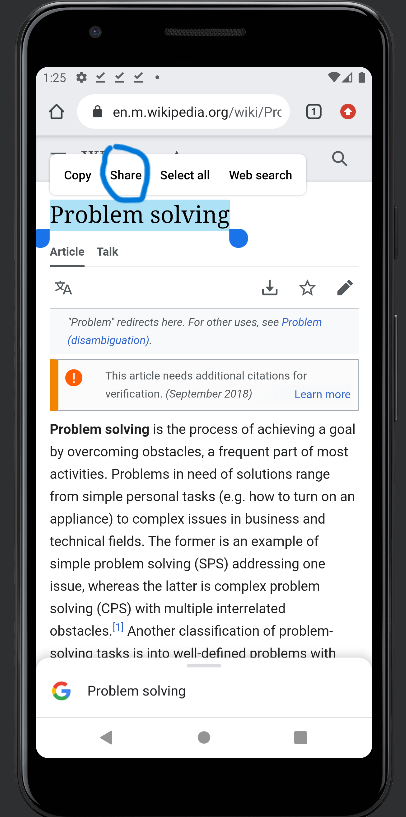
     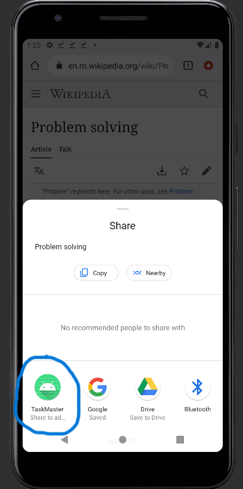
     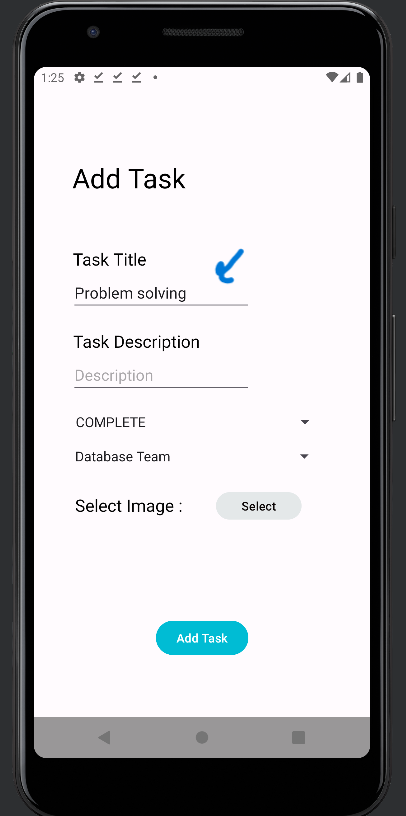
  
- User can add image to the new task easily by sharing from the browser instead of saving it on his device, Steps :

     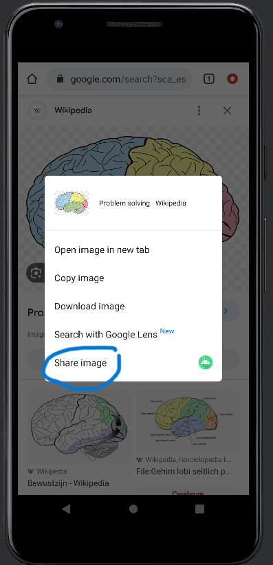
     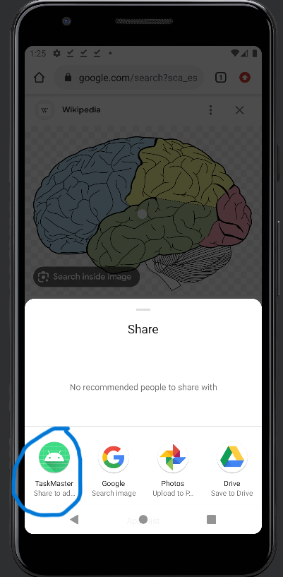
     

### Lab 39, 29/11/2023 :
- Home Icon is added in Task details page, Edit Task page and Add Task page so user can easily return to home.
- When user is adding new Task will be asked for permission for accessing his location.
- Whenever user gives taskmaster the access to his location on every task his location will be added
- User Location will be added on the task details page.
- User can access the Task Details page by clicking on the task from home.
- User can edit his task details by clicking on the edit icon beside the task name in task details page.

### Lab 41, 4/12/2023 :
- Analytics added.
- Sound icon beside task title in Edit Task page and Task Details page is added.
- Whenever user clicks on sound icon text will be converted to Speech so the user can hear title's pronunciation.
- Feature for blind People and disabled one's to deal with taskmaster.

## Screenshots:

### Home page before login
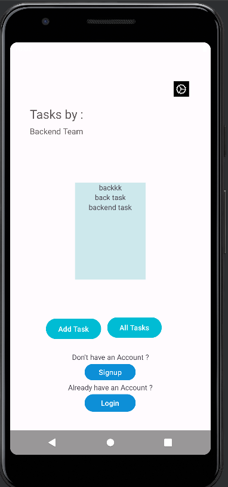 
### Signup page
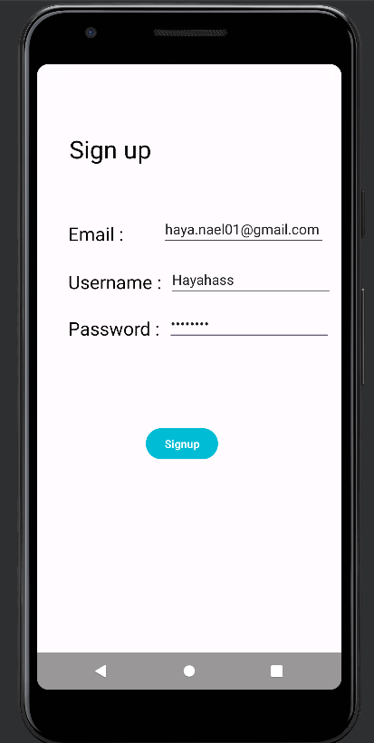
### Verify Email page 
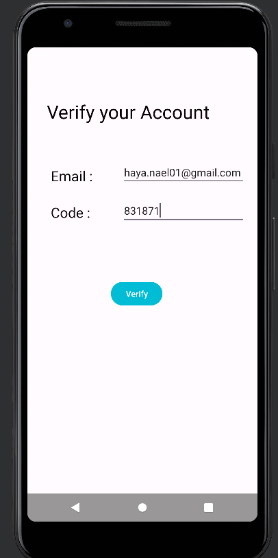
### Login page
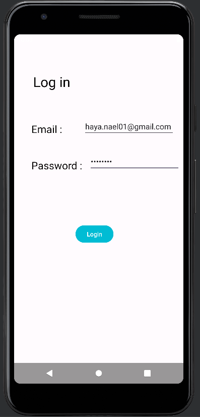
### Home page after login
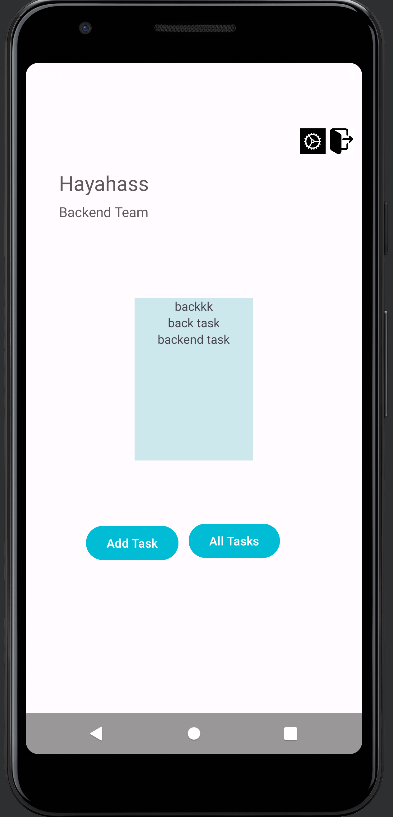
### Add Task page asking for Location Permission

### Add Task page
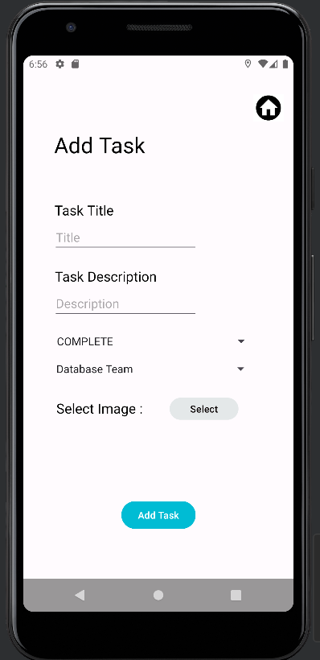
### All Tasks page
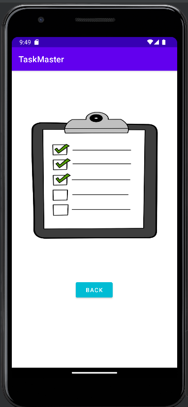
### Settings page
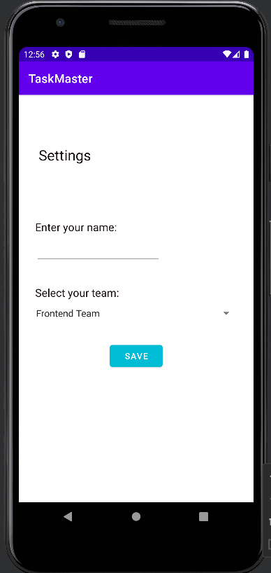
### Edit Task page
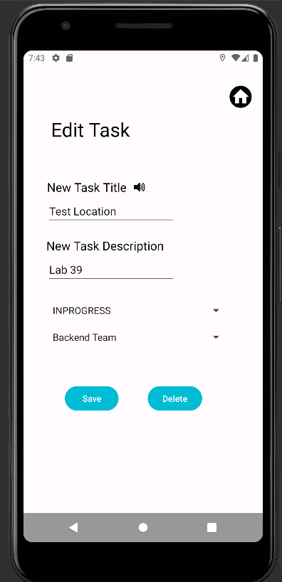 
### Task Details page
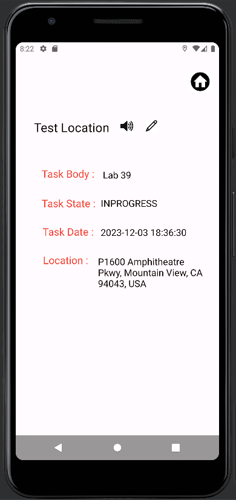 

