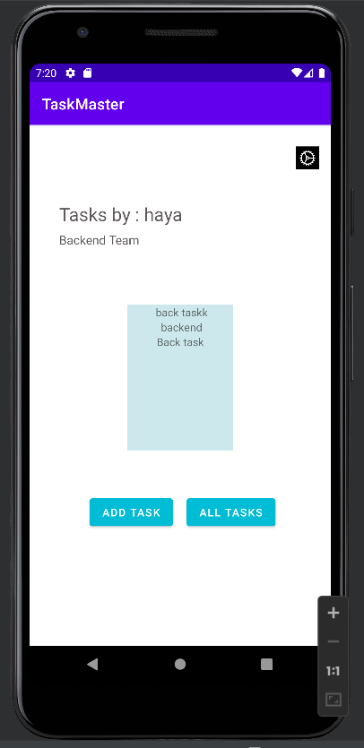
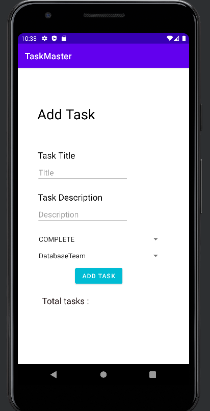
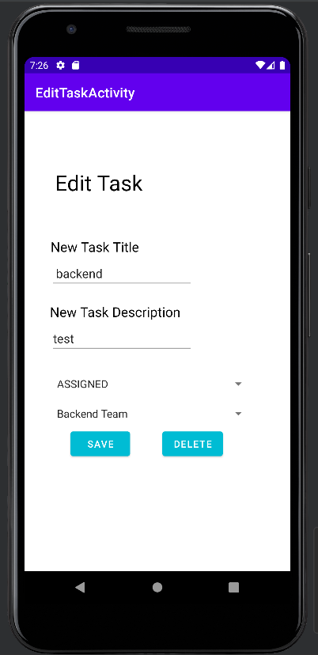
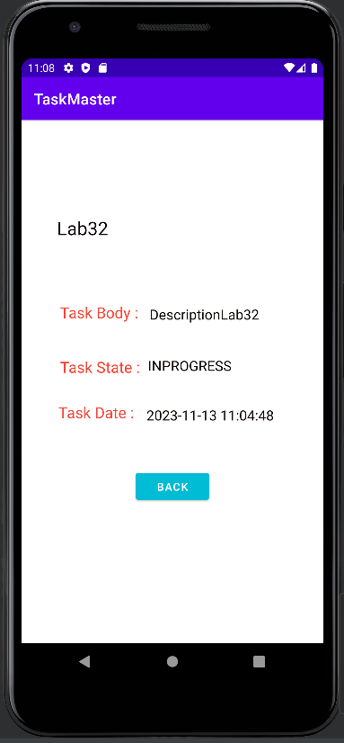

 taskmaster

## In Task Master you can:

 - navigate easily between pages
 - check all tasks you have
 - add new tasks to your list
 - by clicking on specific Task you'll be navigated to task chosen details page
 - by clicking on settings icon in home page you'll be navigated to settings page
 - you can change your username in Setting page and new username will be updated in your home page
 - in home page can scroll up and down between list of tasks
 - You can re-check your task details requirements and state if complete,in progress.. etc by clicking on it
 - Whenever you add a task; your task title will be displayed on the home page and by clicking on it you can go to the details..

## Activities tested using Espresso Testing :

- AddTaskActivity
- SettingsActivity
- TaskDetailsActivity

## Tools used :

 - Android Studio
 - Cmd for Windows
 - AWS amplify
 - DynamoDB

### Lab 32, 8/11/2023 :

- Application's Database added to AWS
- Tasks Table Created on DynamoDB
- Tasks added by user are added to the table
- Tasks are viewed on the RecyclerView from DynamoDB

### Lab 33, 13/11/2023 :

- Teams Table Added to AWS
- Added Many to Many Relationship between tasks table and teams
- Teams are added, user cannot add Teams
- User can assign the task while adding it to specific team
- Tasks are filtered Based on the user team chosen in Settings.

### Lab 34, 15/11/2023 :

- Edit Task Activity added.
- User can update data about specific task.
- User can delete specific task.
- All changes are updated on DynamoDb.

## Screenshots:

### Home page
 
### Add Task page

### All Tasks page

### Settings page

### Edit Task page
 
### Task Details page

